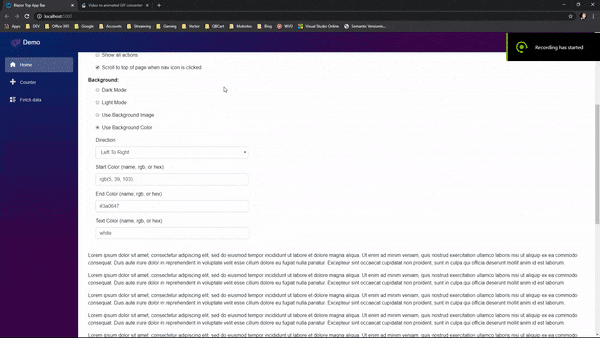

[](https://dev.azure.com/Mobsites-US/Blazor%20Top%20App%20Bar/_build/latest?definitionId=13&branchName=master)

# Blazor Top App Bar
by <a href="https://www.mobsites.com">obsites</a>

A Blazor component that utilizes the [MDC Top App Bar](https://material.io/develop/web/components/top-app-bar/) library and acts as a container for items such as application title, navigation icon, and action items.

## [Demo](https://www.mobsites.com/Blazor.TopAppBar/)
Tap the link above to go to a live demo. Try some of the options to get an idea of what's possible. Then reload the app in the browser and watch how the state was kept! 

Check out its source code [here](./demo).



## For
* Blazor WebAssembly
* Blazor Server

## Dependencies

###### .NETStandard 2.0
* Microsoft.AspNetCore.Components (>= 3.1.2)
* Microsoft.AspNetCore.Components.Web (>= 3.1.2)

## Design and Development
The design and development of this Blazor component was heavily guided by Microsoft's [Steve Sanderson](https://blog.stevensanderson.com/). He outlines a superb approach to building and deploying a reusable component library in this [presentation](https://youtu.be/QnBYmTpugz0) and [example](https://github.com/SteveSandersonMS/presentation-2020-01-NdcBlazorComponentLibraries).

As for the non-C# implementation of this library, obviously Google's MDC Navigation Drawer [docs](https://material.io/develop/web/components/top-app-bar/) were consulted.

All of its variants were included in this component.

## Getting Started
1. Add [Nuget](https://www.nuget.org/packages/Mobsites.Blazor.TopAppBar/) package:

```shell
dotnet add package Mobsites.Blazor.TopAppBar --version 1.0.0-preview1
```

2. Add the following link tag to `index.html` (WebAssembly) or `_Host.cshtml` (Server) just above the closing `</head>` tag, along with your other link tags:

```html
<!-- The order of your style links obviously matters, so reorder them if any conflicts arise -->
<link href="_content/Mobsites.Blazor.TopAppBar/bundle.css" rel="stylesheet" />
```

3. Add the following script tag to `index.html` (WebAssembly) or `_Host.cshtml` (Server) just above the closing `</body>` tag, along with your other script tags:

```html
<!-- Place this below any _framework scripts! -->
<script src="_content/Mobsites.Blazor.TopAppBar/bundle.js"></script>
```

4. Add the following using statement to the `_Imports.razor` file:

```html
@using Mobsites.Blazor
```

5. Add the following markup to the `MainLayout.razor` file or wherever you see fit:

```html
<TopAppBar>
    <TopAppBarHeader>
        <!-- Add navigation toggler here -->
    </TopAppBarHeader>
    <TopAppBarActions>
        <!-- Add action links here -->
    </TopAppBarActions>
</TopAppBar>
```

6. Add css marker `@TopAppBar.AdjustmentMarkerClass` to any content at the top of the page that needs vertical adjustment to avoid being covered by the app bar:

```html
<!-- Add adjustment class to prevent TopAppBar from hiding some of this content -->
<div class="main @TopAppBar.AdjustmentMarkerClass">
```

## Attributes
Below highlights some of the built-in C# attributes and their defaults (if any). Use intellisense to get more details and learn about others:
```html
<TopAppBar
    KeepState
    Variant="TopAppBar.Variants.Standard"
    Color="null"
    BackgroundMode="BackgroundModes.None"
    BackgroundColor="null"
    BackgroundColorDirection="BackgroundColorDirections.BottomToTop"
    BackgroundColorStart="null"
    BackgroundColorEnd="null"
    BackgroundImage="null"
    ScrollToTop="false">
</TopAppBar>
```

## Keeping State
Keeping state is as simple as setting the `KeepState` attribute to true. This component will keep relevant state in the browser's storage. To get a sense of this, check out the [demo](https://www.mobsites.com/Blazor.TopAppBar/), change some options, and refresh the browser to force a reload of the app. 

## Possible CSS Rule Conflicts

You may find that your current styles conflict with this library's css rules. 

You can see all of this library's styles [here](./src/app.scss).